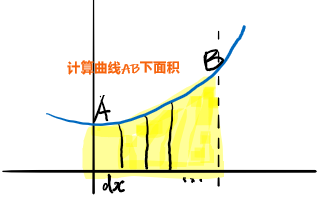

create_time：2020年12月20日

[toc]

前言：导数和微分之间的差异是什么？

## 一、导数的概念

### 1、定义

#### 1.1、导数的定义

定义

> 设y=f(x)在点$x_0$的某领域内有定义，若极限$lim_{x \to x_0} \frac{f(x)-f(x_0)}{x-x_0}$存在，则称f在$x_0$可导，该极限为f在$x_0$的导数，记作$f'(x_0)$

换种表示法

> 令$\Delta x = x-x_0$，$f'(x_0) = lim_{x \to x_0}\frac{\Delta y}{\Delta x}=lim_{x \to x_0} \frac{f(x_0+\Delta x)-f(x_0)}{\Delta x}$
>
> 其中$\frac{\Delta y}{\Delta x}$称为差商

如果极限不存在，则在该点无导数。

#### 1.2、导函数的定义

若函数在区间$I$上每一点都可导（端点为单侧导数），则称f为区间$I$上的可导函数

### 2、待证明

（1）如果函数f在点$x_0$可导，则f在点$x_0$连续

（2）f在点$x_0$可导的充要条件是$f'_+(x_0)$与$f'_-(x_0)$都存在，且$f'_+(x_0) = f'_-(x_0)$

（3）费马定理：函数f在点$x_0$的某领域有定义，且在点$x_0$可导，若点$x_0$为极值点，则必由$f'(x_0)=0$

`称f'(x_0)=0的点x_0为稳定点`

### 3、基础导数

几个必须要记住的基础导数证明

#### 3.1、证明$(x^n)' = nx^{n-1}$，n为正整数

证明：对于$y=x^n$，

由于$\frac{\Delta y}{\Delta x} = \frac{(x+\Delta x)^n-x^n}{\Delta x}$

使用二项式展开得 = $C_n^1x^{n-1} + C_n^2x^{n-2}\Delta x + ... + C_n^n\Delta x^{n-1}$

因此$y' = lim_{\Delta x \to 0}\frac{\Delta y}{\Delta x} = C_n^1x^{n-1} = nx^{n-1}$

#### 3.2、证明(sinx)' = cosx

证明：

补充：证明$sin(x+\Delta x) - sinx = 2sin\frac{\Delta x}{2}cos(x + \frac{\Delta x}{2})$

令A = $x + \frac{\Delta x}{2}$，B=$\frac{\Delta x}{2}$，此时满足$A+B = x+\Delta x$，$A-B = x$

使用公式$cosAsinB = \frac{sin(A+B)-sin(A-B)}{2}$，得证。

#### 3.3、证明(cosx)' = -sinx

证明：

补充：证明$cos(x+\Delta x) - cosx = -2sin\frac{\Delta x}{2}sin(x + \frac{\Delta x}{2})$

令A = $x + \frac{\Delta x}{2}$，B=$\frac{\Delta x}{2}$，此时满足$A+B = x+\Delta x$，$A-B = x$

使用公式$-sinAsinB = \frac{cos(A+B)-cos(A-B)}{2}$，得证。

## 二、求导法则

## 参考资料

## 一、附录

导数与微分概念

什么是导数？什么是微分？有什么差异

导数最初由法国数学家费马Fermat为研究极值问题而引入的，在已知运动规律求速度和已知曲线求切线，是由牛顿和莱布尼茨在研究力学和几何学过程中建立起来的。

知道微积分是牛顿和莱布尼茨搞出来的，原来导数也是啊

### 1、导数的定义

定义

> 设y=f(x)在点$x_0$的某领域内有定义，若极限$lim_{x \to x_0} \frac{f(x)-f(x_0)}{x-x_0}$存在，则称f在$x_0$可导，该极限为f在$x_0$的导数，记作$f'(x_0)$

换种表示法

> 令$\Delta x = x-x_0$，$f'(x_0) = lim_{x \to x_0}\frac{\Delta y}{\Delta x}=lim_{x \to x_0} \frac{f(x_0+\Delta x)-f(x_0)}{\Delta x}$
>
> 其中$\frac{\Delta y}{\Delta x}$称为差商

如果极限不存在，则在该点无导数。

### 2、微分的定义

#### 2.1、定义

> 设y=f(x)在点$x_0$的某领域内$U(x_0)$有定义，当$x_0 + \Delta x \in U(x_0)$时有**增量**
>
> $\Delta y = A\Delta x+o(\Delta x)$
>
> 则称f在点$x_0$可微，$A\Delta x$为f在$x_0$的**微分**，记作$dy|_{x=x_0} = A \Delta x$，或$df(x)|_{x=x_0} = A \Delta x$

#### 2.2、A的值

函数f在点$x_0$可微的充要条件：f在点$x_0$可导，且$A = f'(x_0)$

证明：

> 函数f在点$x_0$可微，有$\Delta y = A\Delta x+o(\Delta x)$
>
> 即$\frac{\Delta y}{\Delta x} = A+o(1)$
>
> 求极限后$f'(x_0) = lim_{x \to x_0}\frac{\Delta y}{\Delta x} = A$

即$dy = f'(x)\Delta x$

#### 2.3、微分的中心思想是无穷分割

怎么理解这句话？

自变量x的微分dx

> 在17世纪，计算曲线是一个热门话题，也是莱布尼茨变换定理的主题。
>
> 他把这个区域的面积想象成无限多个小的矩形构成的，每个矩形宽度为$dx$，高度为y，随着曲线的形状变化而变化。
>
> 这样曲线AB 下的面积$S = sum(dx*y)$
>
> 但是每次写一次sum表示懒得写，用$\int$代替sum，所以AB 下的面积$S = \int ydx$
>
> 
>
> 这里的$dx$被看作是最小可能的长度，一个**无限小**的不能再分的长度（后来$dx$表示微分）
>
> 莱布尼茨解释不清楚无穷小是怎么的一个概念，表示：反正就是特别特别的小

### 3、导数和微分

#### 3.1、符号：dy表示微分还是导数？

答案：微分的意思

微分$dy = f'(x)\Delta x$

#### 3.3、导数和微分关系：微商

自变量的微分$dx$等于自变量的增量$\Delta x$，即$dx = \Delta x$（为什么这么写？【暂放】）

所以$dy = f'(x)\Delta x = f'(x)dx$

即$f'(x) = \frac{dy}{dx}$

导数等于函数微分与自变量微分的商，因此导数也叫微商

