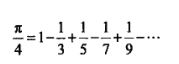

create_time：2020年12月13日

[toc]

级数这个游戏每个数学家都在玩，能留下闪光点写进课本都是超级牛逼的

希望能整理出整体的逻辑图

## 一、数项级数基础概念

### 1、什么是数项级数（柯西）

给定一个数列{$u_n$}，对它的各项依次用+号连接起来的表达式$u_1+u_2+...+u_n+...$称为数项级数，简称级数

* 其中$u_n$为级数的通项或一般项
* 简写为$\sum_{n=1}^{\infty}u_n$，或简写为$\sum u_n$
* 前n项的和称为部分和$S_n$

## 二、保住头发的判别法

求级数是数学家们很喜欢玩的游戏，但是有些级数本身是发散的没有解的。我们必须谨慎对待收敛和发散的问题，以免发散级数把数学家们引入歧途。

### 1、数项级数的柯西准则

级数收敛的充要条件为：任意正数$\epsilon$,存在正整数N，当m>N时，对任何正整数p都有

$|u_{m+1}+u_{m+2}+...+u_{m+p}|<\epsilon$

* 【推论】级数收敛的必要条件为：$lim_{n \to \infty}u_n = 0$

### 2、正项级数

各项都是有正数组成的级数称为正项级数（随着n增大，S的值越来越大，单调递增的）

由于正项级数的单调递增特性，有些判别法是独有的。

#### 2.1、比较原则

**写法一**

如果$\sum u_n$和$\sum v_n$是正项级数，如果存在正数N，对一切n>N，有$u_n<=v_n$

* 若$\sum v_n$收敛，则$\sum u_n$收敛
* 若$\sum u_n$发散，则$\sum v_n$发散

**写法二**

如果$\sum u_n$和$\sum v_n$是正项级数，$lim_{n \to \infty}\frac{u_n}{v_n} = l$

* 当$0<l<+\infty$时，同敛散
* 当$l=0$时，$\sum v_n$收敛，则$\sum u_n$收敛
* 当$l=+\infty$时，$\sum v_n$发散，则$\sum u_n$发散

#### 2.2、达朗贝尔判别法/比式判别法

**写法一**

如果$\sum u_n$正项级数，存在N，$0<q<1$

* 对于n>N，有$\frac{u_{n+1}}{u_n}<=q$，则级数收敛
* 对于n>N，有$\frac{u_{n+1}}{u_n}>=1$，则级数发散

**写法二**

如果$\sum u_n$正项级数，$lim_{n \to \infty}\frac{u_{n+1}}{u_n} = q$

* 当$q<1$时，级数收敛
* 当$q>1$时，级数发散
* q=1时，无法判断结果，用其他方法吧

#### 2.3、柯西判别法/根式判别法

**写法一**

如果$\sum u_n$正项级数，存在N

* 对于n>N，有$\sqrt[n]{u_n}<=l<1$，则级数收敛
* 对于n>N，有$\sqrt[n]{u_n}>=1$，则级数发散

**写法二**

如果$\sum u_n$正项级数，$lim_{n \to \infty}\sqrt[n]{u_n} = l$

* 当$l<1$时，级数收敛
* 当$l>1$时，级数发散

#### 2.4、积分判别法

暂放

### 3、特殊类型级数

讨论一些特殊类型的级数收敛性问题

#### 3.1、【交错级数】莱布尼茨判别法

若级数各项正负相间称为交错级数，若交错级数满足

* 数列${u_n}$单调递减
* $lim_{n \to \infty}u_n=0$

则级数收敛

> 讲到莱布尼茨的时候提到**莱布尼茨级数**，求导了$\pi$的近似值，莱布尼茨因为这个级数的发现被牛顿派打上了“抄袭”的帽子。
>
> 

#### 3.2、【绝对收敛级数】

若级数各项绝对值所组成的级数收敛，则称原式为绝对收敛级数

### 4、一般项级数

#### 4.1、阿贝尔判别法

讨论级数$\sum a_nb_n$的敛散性

* 若{a_n}为单调有界数列，级数$\sum b_n$收敛，则$\sum a_nb_n$收敛

#### 4.2、狄利克雷判别法

讨论级数$\sum a_nb_n$的敛散性

* 若{a_n}为单调递减，且$lima_n=0$，级数$\sum b_n$部分和数列有界，则$\sum a_nb_n$收敛

### 5、一起玩的级数

出题目的时候一般会带上等比级数，q级数一起玩的

#### 5.1、等比级数

等比级数： $a+aq+aq^2+...+aq^n+...$

部分和：$S_n = a\frac{1-q^n}{1-q}$

* 当|q|<1时，收敛，级数和为$\frac{a}{1-q}$
* 当|q|>1时，发散，级数和为$\infty$
* 当q=1，发散，级数和为$na$
* 当q=-1，发散，$S_{2k}=0$,$S_{2k+1}=a$

#### 5.2、P级数

p级数，又称超调和级数： $\sum \frac{1}{n^p}$

当p>1时，级数收敛； 当p<=1时，级数发散

部分和$S_n = $

#### 5.3、调和级数

调和级数$1+\frac{1}{2}+\frac{1}{3}+...+\frac{1}{n}+...$是发散的

使用柯西准则

$|u_{m+1}+u_{m+2}+...+u_{2m}|>=|\frac{1}{2m}+...+\frac{1}{2m}|=\frac{1}{2}$

取$\epsilon=\frac{1}{2}$，对任何正整数N，当m>N,p=m时不满足小于$\epsilon$，因此级数发散

## 三、计算级数

光判别是不够的，我们的唯一目标就是求级数值，求不出来都是废话

### 1、【暂放】导数的使用

一般是Sn的求导，整体的求导等价于每个项的求导，$[\sum f(x)]' = \sum f'(x)$

## 参考资料

