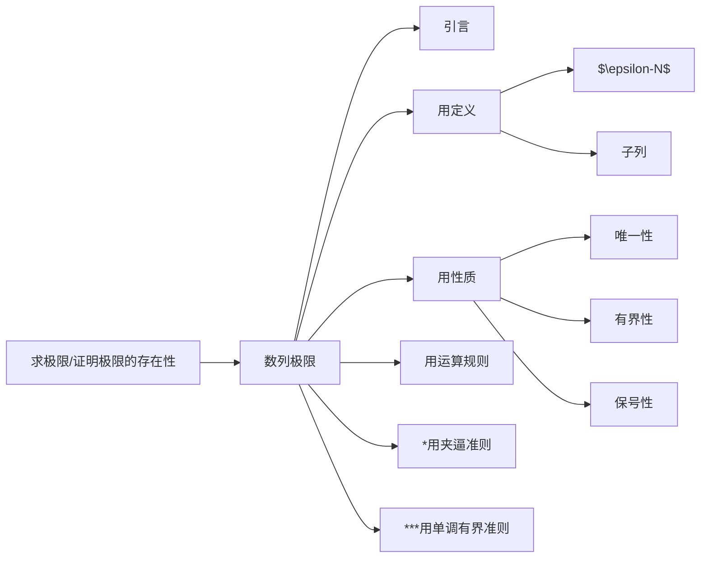

[toc]

# 一、数列极限

几乎每年压轴题都在“用单调有界准则”上。

## 1、引言

极限，从通俗直观的意义上讲，是一个“无限趋近的过程”。弄了两百年才梳理出数学定义。

三部曲：

取任意$\epsilon>0$

步骤一：写$|a_n-a|<\epsilon$

步骤二：反写$n>g(\epsilon)$

步骤三：取$N=[g(\epsilon)]+1$, (n>N)

## 2、定义

（1）数列极限$\epsilon-N$定义

$lim_{n \to \infty}a_n = a$ 充要条件（定义）：

> 任意$\epsilon>0$，存在$N>0$时，当$n>N$，恒有$|a_n-a|>\epsilon$

（2）子数列（下标重排）

> 数列$\{a_n\}$收敛的充要条件是：$\{a_n\}$的任何子列都收敛

进一步：

如果数列$\{a_n\}$收敛，则其任何子列$\{a_{nk}\}$也收敛，且$lim_{k \to \infty}a_{nk} = lim_{n \to \infty}a_n$

（3）推论

$lim_{n \to \infty}a_n = a \Longleftrightarrow lim_{k \to \infty}a_{2k} =a$，且$lim_{k \to \infty}a_{2k-1} =a$

这个定理的好处不在于本身，而在于其逆否命题，一般用来判断数列是否发散（如果存在发散的子列，则数列发散；如果收敛值不一样也发散）。

## 3、性质

唯一性：记住就好了，不用证明的

有界性：记住好了

保号性（五星）：

> 脱帽法：如果$lim_{n \to \infty}a_n = a>0$，则存在$n>N$，有$a_n>0$
>
> 戴帽法：如果$lim_{n \to \infty}a_n=a$ 且通项$a_n>0$，则a>=0

# 参考资料

2021版张宇高等数学考研数学基础30讲高等数学【期末复习适用】

[1] 数列极限1：https://www.bilibili.com/video/BV1ME411M7hp?p=6

[2] 数列极限2：https://www.bilibili.com/video/BV1ME411M7hp?p=7