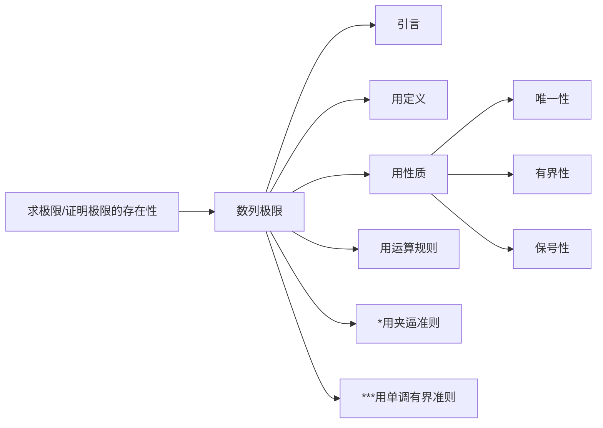

[toc]

# 一、数列极限

几乎每年压轴题都在“用单调有界准则”上。

## 1、引言

极限，从通俗直观的意义上讲，是一个“无限趋近的过程”。弄了两百年才梳理出数学定义。

三部曲：

步骤一：写$|a_n-a|<\epsilon$

步骤二：反写$n>g(\epsilon)$

步骤三：取$N=[g(\epsilon)]+1$, (n>N)

## 2、定义

# 参考资料

2021版张宇高等数学考研数学基础30讲高等数学【期末复习适用】

https://www.bilibili.com/video/BV1ME411M7hp?p=6